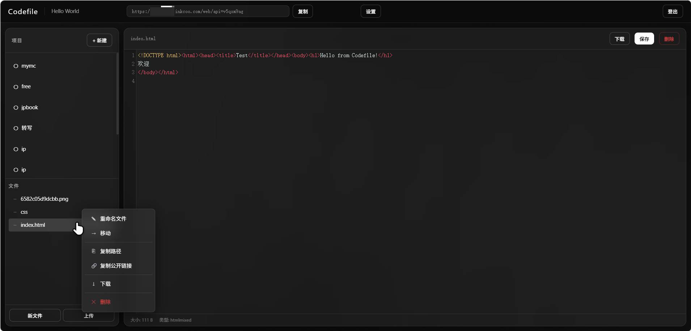

# Codefile

> 上传即分享，一条直链搞定静态内容分发。无需 Git、无需服务器，基于 Cloudflare 边缘生态零成本运行。

---

## 项目动机

随着 AI 工具的普及，越来越多内容由大模型直接生成——HTML 原型、Markdown 笔记、作品集、技术文档。这些内容最大的诉求不是"写出来"，而是"分享出去"。

但现实是：传统静态托管（GitHub Pages / Netlify / Vercel）要求 Git 仓库与构建流程，对非技术用户太重；云存储（COS / OSS）需要开通账号、管理密钥、按量计费；协同文档（Notion / 语雀）无法托管任意静态文件，也不能自定义域名。

**Codefile** 就是为这个缺口而生的：打开网页、登录、上传文件、拿到一条公开直链——全程浏览器内完成，不装任何工具，不花一分钱。它要做的只有一件事：**让"上传即分享"这件事的链路短到不能再短。**

---

## 关于作者

| 项目 | 信息 |
|------|------|
| 作者 | koshoutou（Inkcoo） |
| 院校 | 湖南农业大学 |
| 方向 | 自学 AI 全栈开发，关注 AI 应用工程与 Web 产品设计 |
| 联系方式 | GitHub：[@koshoutou](https://github.com/koshoutou) |

---

## 功能介绍

### 核心能力

| 功能 | 说明 |
|------|------|
| 上传即直链 | 任意文件上传后自动生成公开访问链接，零配置、零构建 |
| 多项目管理 | 每个项目独立空间，自动生成 `/web/api={id}` 访问地址，支持自定义 slug |
| 文件 CRUD | 创建、编辑、移动、重命名、上传、下载、删除，支持文件夹级批量操作 |
| 图片预览 | jpg / png / gif / webp / svg 在编辑区直接预览 |
| Markdown 渲染 | 访问 `.md` 文件自动渲染为 HTML 预览页，支持深色/浅色主题切换 |
| 公开直链 | 任意文件公开可访问，支持 `?download=1` 强制下载、`?raw=1` 查看源码 |
| 自定义域名 | Cloudflare Pages 一键绑定，URL 基于 `location.origin` 动态生成 |

### 管理后台

| 功能 | 说明 |
|------|------|
| 账号体系 | SHA-256(salt + password) 口令校验 + HttpOnly Cookie 会话（7 天有效期） |
| 文件树与右键菜单 | 复制路径、复制公开链接、移动、重命名、删除，操作直观 |
| CodeMirror 编辑器 | 在线编辑代码文件，语法高亮，即改即存 |
| 路径安全 | 服务端过滤 `..` 目录遍历，前端对特殊字符自动 URL 编码 |

### 工程特性

| 特性 | 说明 |
|------|------|
| 零服务器 | 完全运行在 Cloudflare 免费额度内，无服务器实例、无数据库费用 |
| Agent 友好 | 所有操作均以 REST API 暴露，可作为 AI Agent 自动上传内容的脚手架 |
| 元数据与内容分离 | 项目信息存 KV（毫秒级查询），文件内容存 R2（10 GB 免费对象存储） |

---

## 界面预览

管理后台：项目列表、文件树、右键菜单（重命名 / 移动 / 复制公开链接 / 下载 / 删除）与 CodeMirror 编辑器。



---

## 快速开始

在已安装 Node.js >= 18 的前提下，最快几分钟内即可本地跑起来（本地用 Miniflare 模拟 KV / R2，无需真实 Cloudflare 账号）：

```bash
# 1. 安装依赖
npm install

# 2. 启动本地开发
npx wrangler pages dev public --port 8788
# 浏览器打开 http://localhost:8788 ，默认账号 inkcoo / inkcoo
```

如需部署到 Cloudflare Pages，依次完成：创建 KV 命名空间与 R2 存储桶 → 在 `wrangler.toml` 填入 KV id 与账号密码 → `npx wrangler pages deploy public --project-name codefile --branch main`。完整步骤见 [部署流程](#部署流程)。

---

## 技术栈

| 层级 | 技术 | 说明 |
|------|------|------|
| 前端 | 原生 HTML / CSS / JS | 零构建、零依赖，Cloudflare Pages 直接托管 |
| 编辑器 | CodeMirror 5（CDN） | 语法高亮、零安装 |
| Markdown 渲染 | marked.js（CDN） | 轻量、支持 GFM |
| 后端 | Cloudflare Pages Functions | 边缘计算、零服务器，JS 即可编写 |
| 文件存储 | Cloudflare R2 | 10 GB 免费、S3 兼容 |
| 元数据存储 | Cloudflare KV | 毫秒级查询、10 亿读/月免费 |
| 部署 | `wrangler pages deploy` | 命令行一键部署 |

---

## 系统架构

```
┌─────────────────────────────────────────────────┐
│                   用户浏览器                      │
│  ┌───────────┐    ┌───────────────────────────┐  │
│  │  登录/管理  │    │  公开访问 /web/api=slug  │  │
│  └──────┬────┘    └──────────────┬────────────┘  │
└─────────┼────────────────────────┼───────────────┘
          │                        │
          ▼                        ▼
┌─────────────────────────────────────────────────┐
│           Cloudflare Pages Functions             │
│                                                 │
│  ┌─ _middleware.js ──────────────────────────┐  │
│  │  · CORS 头                                 │  │
│  │  · /api/* 鉴权（除 /api/auth /api/logout） │  │
│  │  · Cookie → KV session 校验                │  │
│  └───────────────────────────────────────────┘  │
│                                                 │
│  ┌─ api/auth.js  ─┐  ┌─ api/logout.js  ─┐      │
│  │  密码校验 + 发    │  │  清 session + 清  │      │
│  │  session Cookie │  │  Cookie             │      │
│  └────────────────┘  └─────────────────┘      │
│                                                 │
│  ┌─ api/projects.js ────────────────────┐      │
│  │  GET  列出项目 / POST 创建项目        │      │
│  │  /api/projects/[id].js: PATCH 更新   │      │
│  │                          DELETE 删除   │      │
│  └──────────────────────────────────────┘      │
│                                                 │
│  ┌─ api/files/[[route]].js ─────────────┐      │
│  │  GET  列表 / 读内容 / 下载           │      │
│  │  PUT  创建 / 编辑                    │      │
│  │  POST multipart 上传                 │      │
│  │  PATCH 移动 / 重命名                │      │
│  │  DELETE 删除文件 / 删除文件夹         │      │
│  └──────────────────────────────────────┘      │
│                                                 │
│  ┌─ web/[[path]].js ─────────────────────┐      │
│  │  · 解析 /web/api={slug}/{file}       │      │
│  │  · KV slug → projectId 映射          │      │
│  │  · R2 对象读取 + MIME 推断            │      │
│  │  · .md 文件自动渲染为 HTML 预览页     │      │
│  │  · 安全：路径遍历过滤、非公开、无鉴权 │      │
│  └──────────────────────────────────────┘      │
└─────────────────────────────────────────────────┘
                     │
          ┌──────────┴──────────┐
          ▼                     ▼
┌─────────────────┐     ┌──────────────────────┐
│ Cloudflare KV   │     │ Cloudflare R2         │
│ CODEFILE_KV     │     │ codefile-static-assets│
│                 │     │                       │
│ proj:{id}       │     │ {projectId}/path/to  │
│ → {name, slug}  │     │ 文件内容（原始字节）   │
│ slug:{slug}     │     └──────────────────────┘
│ → projectId     │
│ session:{token} │
│ → {username}    │
└─────────────────┘
```

---

## 部署流程

### 前置条件

- Node.js >= 18
- 一个 Cloudflare 账号
- Cloudflare API Token（Account 级，具备 Pages / KV / R2 权限）

### 1. 安装依赖

```bash
cd codefile
npm install
```

### 2. 创建 Cloudflare 资源

```bash
# KV 命名空间（记下输出中的 id）
npx wrangler kv namespace create CODEFILE_KV

# R2 存储桶
npx wrangler r2 bucket create codefile-static-assets

# Pages 项目（如已存在可跳过）
npx wrangler pages project create codefile --production-branch main
```

### 3. 配置 `wrangler.toml`

将上一步得到的 KV id 填入，并按需修改账号与密码：

```toml
[[kv_namespaces]]
binding = "CODEFILE_KV"
id = "此处替换为真实 KV id"

[[r2_buckets]]
binding = "STATIC_ASSETS"
bucket_name = "codefile-static-assets"

[vars]
AUTH_USERNAME = "inkcoo"
PASSWORD_SALT = "codefile_salt_2024"
PASSWORD_HASH = "c816ff5d672fff78ca9256fc7bfb9b8c31d7fc03a02a2f8c24170e8e13ffeda7"
SESSION_TTL = "604800"
```

修改密码（计算 SHA-256(salt + password) 后替换 `PASSWORD_HASH`）：

```bash
node -e "const c=require('crypto');const s='codefile_salt_2024';const p='新密码';console.log(c.createHash('sha256').update(s+p).digest('hex'))"
```

### 4. 本地开发

```bash
npx wrangler pages dev public --port 8788
# 打开 http://localhost:8788 ，默认账号 inkcoo / inkcoo
```

### 5. 部署上线

```bash
npx wrangler pages deploy public --project-name codefile --branch main
```

### 6. 绑定自定义域名（可选）

Cloudflare Dashboard → Pages → codefile → Custom Domains → 添加域名。

---

## 安全设计

| 威胁 | 防护措施 |
|------|----------|
| 明文密码 | SHA-256(salt + password) 存入环境变量，仓库不含原始口令 |
| XSS 窃取会话 | `Set-Cookie: HttpOnly; Secure; SameSite=Strict` |
| 目录遍历 | 后端过滤 `..`，前端对路径做 URL 编码 |
| 未授权访问 | `/api/*` 强制 Cookie 校验，`/web/*` 纯公开无鉴权 |
| 大文件上传 | 依赖 Workers 默认请求体上限，更大文件可改用 R2 multipart 分片 |

---

## 开源许可

本项目基于 **MIT License** 开源，可自由使用、修改与二次分发，使用时请保留原作者署名。
